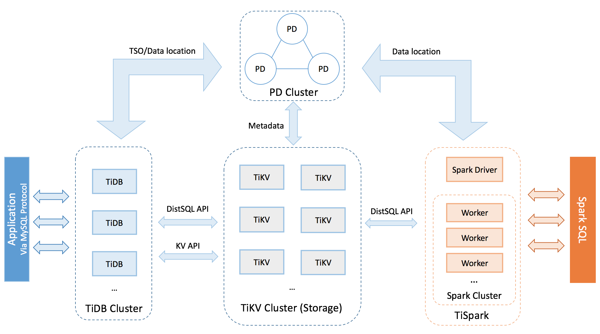

TiDB overview...



[TiDB Markdown](./tidb.md)

```javascript
const Header = () => (
  <header className={styles.container}>
    <Link to="/">
      
    </Link>
    <nav>
      <ul className={styles.nav_links}>
        <li>
          <Link to="cases">Cases</Link>
        </li>
        <li>
          <Link to="about">About</Link>
        </li>
      </ul>
    </nav>
  </header>
)

export default Header
```

inline code example:

`npm install --save gatsby-transformer-remark gatsby-remark-prismjs prismjs`
